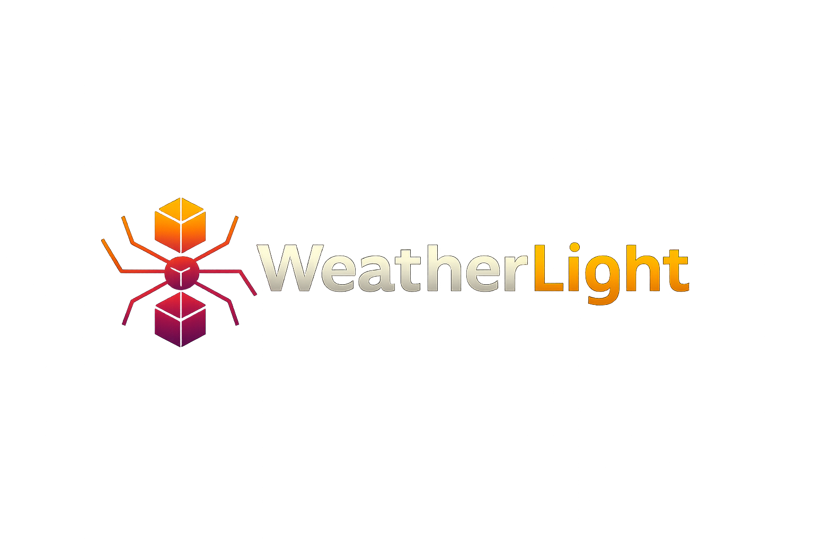

ESP32-based intelligent LED weather display system with GitHub OTA updates.

## Features

- Real-time weather visualization on addressable LEDs (WS2812/NeoPixel)

- Open-Meteo integration (no API key required)

- Weather effects engine (clear, clouds, rain, storm, fog, snow + more)

- Sun tracker with automatic sunrise/sunset timing (daily schedule)

- Night Mode with PIR motion sensor (gentle red light, configurable hours)

- GitHub OTA updates (safe remote firmware upgrades)

- Captive portal Wi-Fi setup (AP mode for first-time configuration)

- Web status panel (device info, mode, update status, diagnostics)

- Persistent settings (NVS) — updates don’t wipe user configuration

- Offline / error fallbacks (Wi-Fi/NTP/API failure handling)

- Seasonal mode (Christmas effects support)
